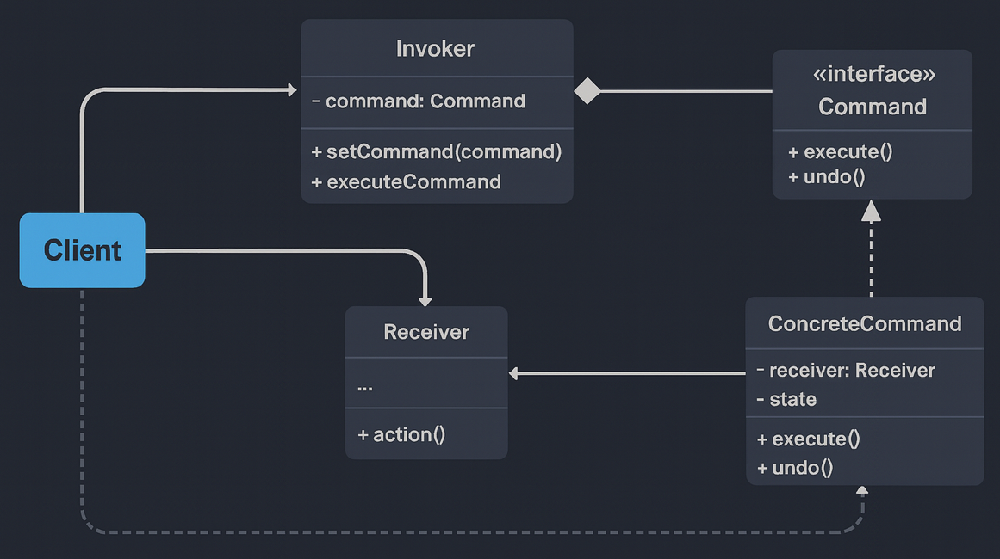

# Command Pattern — Order Operation Command System (With Undo Support)

This module demonstrates the **Command Design Pattern** from the Behavioral Design Patterns family using a real-world, enterprise-grade *E-Commerce Order Operation System*.

Command Pattern states:

> **Encapsulate a request as an object, allowing you to parameterize clients, queue or log requests, and support undoable operations.**

In simple terms:  
➡️ Each business operation becomes a *Command* object with `execute()` and `undo()` methods.  
➡️ Invokers trigger commands without knowing the underlying business logic.  
➡️ Undo history is maintained cleanly using a stack.

---

## 🚫 Violation (Problem)

In the Problem version:

service.placeOrder("ORD-101");
service.cancelOrder("ORD-101");
service.shipOrder("ORD-101");
service.refundOrder("ORD-101");

This leads to:

- Tight coupling between client and business logic  
- No **Undo** support  
- No ability to queue, log, or schedule operations  
- Violates **Open/Closed Principle** — new operations require editing client code  
- Impossible to represent actions as objects  
- Hard to extend into macro operations or workflows  

---

## ✅ Command-Compliant Solution (With Undo Support)

We introduce the full Command Pattern infrastructure:

| Concern | Implementation | Description |
|--------|----------------|-------------|
| Command Interface | `Command` | Declares `execute()` and `undo()` |
| Concrete Commands | `PlaceOrderCommand`, `CancelOrderCommand`, `RefundOrderCommand`, etc. | Encapsulate each action + its undo logic |
| Receiver | `OrderService` | Actual business logic (place, cancel, refund, ship, notify) |
| Invoker | `CommandInvoker` | Executes commands and maintains undo stack |
| Client | `Client.java` | Creates commands and submits them to the Invoker |

This design enables:

- Full **Undo/Redo** capability  
- Commands can be persisted, queued, logged, scheduled  
- Loose coupling between UI/Client and business logic  
- Clean extension — add new commands without modifying existing code  
- Ideal basis for workflow engines and transactional systems  

---

## 🧠 UML Reference

---

## 👌 Benefits of This Design

- ✔ Encapsulates each action as an independent object  
- ✔ Adds full **undo** capability  
- ✔ Enables command logging, queuing, batching  
- ✔ Supports macro commands (future extension)  
- ✔ UI, API, or schedulers can trigger commands uniformly  
- ✔ Complies with **OCP**, **SRP**, and **DIP**  
- ✔ Perfect for distributed, event-driven architectures  

---

## 📦 How It Works

CommandInvoker manages command execution:

invoker.executeCommand(new PlaceOrderCommand(service, "ORD-500"));
invoker.executeCommand(new ShipOrderCommand(service, "ORD-500"));
invoker.undoLast(); // undo shipping

Execution flow:

Client → Invoker → Command → Receiver

Undo flow:

Invoker → pop history → Command.undo()

Each command holds the required data (orderId, message, state) needed to undo the operation.

---

## 🧪 Sample Output

[OrderService] Order placed: ORD-500  
[OrderService] Order shipped: ORD-500  
[OrderService] Notification to ORD-500: Your order has shipped!  
[OrderService] Order cancelled: ORD-500  

--- Undo operations ---  
[CancelOrderCommand] Undo -> placing order ORD-500 again  
[NotifyUserCommand] Undoing notification (no-op)  

This output clearly shows:

- Commands executing independently  
- Invoker calling undo logic correctly  
- Decoupled and extensible behavior  

---

## 🛑 Common Interview Traps

- ❌ Command vs Strategy confusion  
- ❌ Forgetting Receiver role  
- ❌ Not supporting undo/redo  
- ❌ Storing business logic inside commands (should be in Receiver)  
- ❌ Hardcoding invoker → violates decoupling  
- ❌ Treating commands as simple function calls instead of full objects  

---

## ✅ When to Use

Use Command Pattern when:

- You need **Undo/Redo** (CRITICAL)  
- Requests must be **queued**, **logged**, or **replayed**  
- You want decoupled UI elements (buttons, menus, APIs)  
- Operations must be **macro-commands** (batch operations)  
- You want a scalable task execution/automation system  
- You want clean separation of business logic (Receiver) and invocation logic (Invoker)

Avoid when:

- Operations are extremely simple  
- Undo isn't required and commands don’t need persistence  
- A direct method call is more readable and sufficient  

---

## 🏁 One-Liner Summary

> Command Pattern turns every operation into an independent, undoable object — enabling clean, decoupled, schedulable, and history-aware workflows.

---

Happy coding! 🚀
