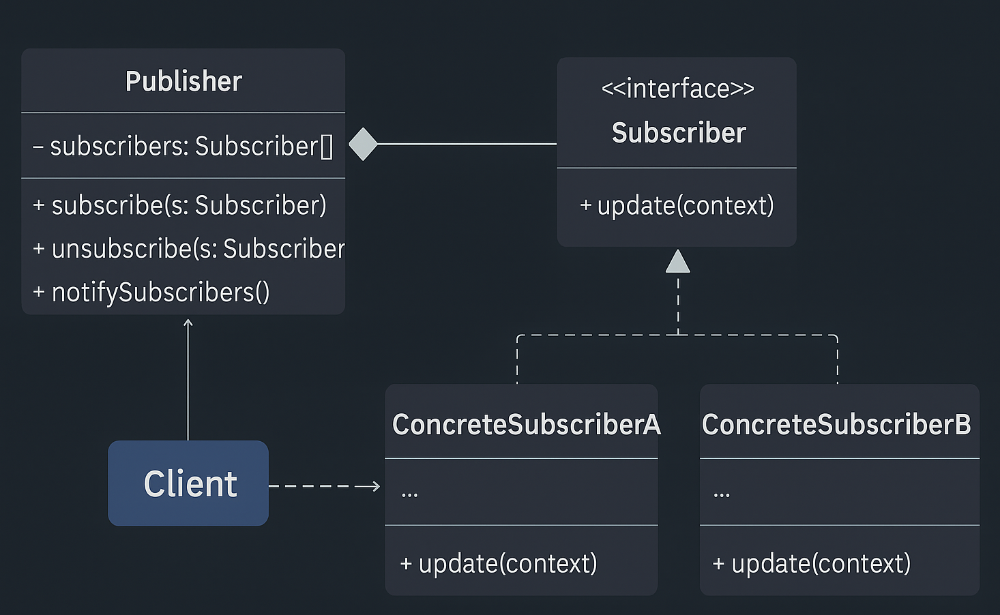

# Observer Pattern — Order Status Tracking System

This example demonstrates the **Observer Design Pattern** from the **Behavioral Design Patterns** family using a real-world, industry-level *Order Status Tracking* scenario.

Observer Pattern states:

> **Define a one-to-many dependency between objects such that when one object (Subject) changes state, all its dependents (Observers) are notified automatically.**

In simple terms:  
➡️ Many systems “subscribe” to order updates.  
➡️ When order status changes, the system notifies all subscribers instantly.

---

## 🚫 Violation (Problem)

In the Problem version, `OrderService` directly calls every dependent service:

```java
customer.notifyCustomer(order);
warehouse.updateWarehouse(order);
delivery.updateDeliveryPartner(order);
analytics.recordEvent(order);
```

This leads to:

- Tight coupling between `OrderService` and all dependent systems  
- Violation of **Open/Closed Principle (OCP)**  
- Violation of **Single Responsibility Principle (SRP)**  
- Adding/removing observers requires modifying `OrderService`  
- No dynamic subscription mechanism  
- Hard to extend, hard to test, not scalable  

This is a common anti-pattern in real microservices and e-commerce codebases.

---

## ✅ Observer-Compliant Solution

We introduce a **Subject** (`OrderStatusPublisher`) that manages subscriptions.  
Services such as Customer, Warehouse, Delivery Partner, and Analytics become **Observers**.

| Concern | Implementation | Description |
|---------|----------------|-------------|
| Subject | `OrderStatusPublisher` | Manages list of observers; notifies them |
| Observer Interface | `OrderObserver` | Defines `update(Order order)` |
| Concrete Observers | Multiple services (Customer, Warehouse, Delivery, Analytics) | React independently to updates |
| Business Entity | `Order` | On status change → triggers notification via publisher |
| Client | `Client.java` | Registers observers and updates order |

This design ensures:

- Order status changes propagate automatically  
- No hardcoded dependencies  
- Observers may be added/removed freely  
- Strict OCP & DIP compliance  
- Event-driven, scalable architecture  

---

## 🧠 UML Reference



---

## 👌 Benefits of This Design

- ✔ Fully decoupled architecture  
- ✔ Scalable event-driven design  
- ✔ Easy to add new observer services  
- ✔ Eliminates if-else and duplicated notification logic  
- ✔ Complies with **OCP**, **SRP**, **DIP**  
- ✔ Realistic for distributed systems (notification, tracking, dashboards)  

---

## 📦 How It Works (Solution)

`Client.java`:

1. Creates an `OrderStatusPublisher` (Subject)  
2. Registers observers  
3. Creates an `Order` bound to the publisher  
4. Calls `order.updateStatus(status)`  
5. Publisher notifies all observers automatically  

Example:

```java
publisher.attach(new CustomerNotificationService());
publisher.attach(new WarehouseService());

order.updateStatus("SHIPPED");  
// All observers get notified
```

---

## 🧪 Test Output

```
[Order] Updating status: PLACED -> PACKED
[CustomerNotificationService] Customer notified: Order ORD-2001 is now PACKED
[WarehouseService] Warehouse updated: Order ORD-2001 is now PACKED
[DeliveryPartnerService] Delivery partner updated: Order ORD-2001 is now PACKED
[AnalyticsService] Event recorded: Order ORD-2001 changed to PACKED
```

The output clearly shows **all observers reacting** to the same event.

---

## 🛑 Common Interview Traps

- ❌ Confusing Observer with Pub/Sub (Observer = in-memory; Pub/Sub = message broker)  
- ❌ Subject pushing too much data instead of state change  
- ❌ Observer performing business logic that should be in the domain layer  
- ❌ Forgetting unsubscribe → memory leaks  
- ❌ Tight-coupled observers (should depend only on the interface)  

---

## ✅ When to Use

Use Observer Pattern when:

- Multiple components must react to the same event  
- You want automatic state-change propagation  
- New subscribers should be added without modifying core logic  
- Building event-driven, loosely coupled systems  
- Order tracking, notifications, analytics, dashboards, live updates  

Avoid when:

- Event delivery must be guaranteed or asynchronous → use Pub/Sub, Kafka, or queues  
- Too many observers create performance bottlenecks  
- Tight data contracts make frequent notifications heavy  

---

## 🏁 One-Liner Summary

> Observer Pattern enables clean, scalable, event-driven systems by decoupling publishers from subscribers — perfect for real-world order tracking and notification pipelines.

---

Happy coding! 🚀
