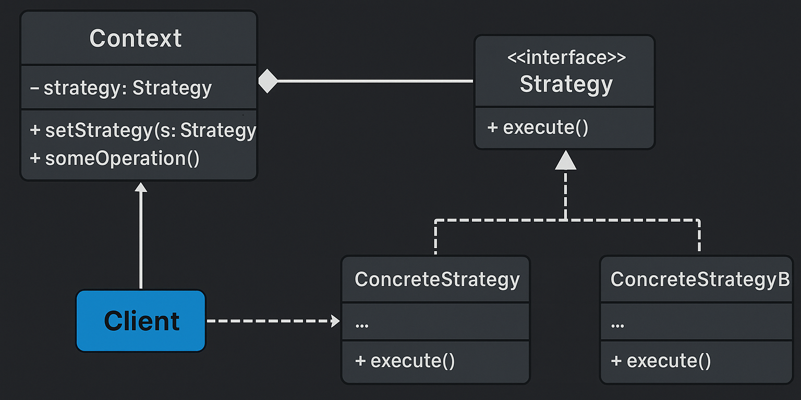

# Strategy Pattern — Shipping Cost Calculation Engine

This example demonstrates the **Strategy Design Pattern** from the **Behavioral Design Patterns** family using a real-world, industry-level *Shipping Cost Engine*.

Strategy Pattern states:

> **Define a family of algorithms, encapsulate each one, and make them interchangeable at runtime.**

In simple terms:  
➡️ The application selects a *shipping cost algorithm* at runtime without modifying core logic.

---

## 🚫 Violation (Problem)

In the problem version, the class `ShippingCalculator` contains a hardcoded `if/else` chain:

```java
if (type.equals("FLAT_RATE")) ...
else if (type.equals("WEIGHT_BASED")) ...
else if (type.equals("DISTANCE_BASEBASED")) ...
else if (type.equals("THIRD_PARTY_API")) ...
```

This leads to:

- Tight coupling between calculator and all shipping rules  
- Violation of **Open/Closed Principle (OCP)**  
- Adding new shipping types requires modifying the core class  
- Makes unit testing difficult  
- Logic becomes unmaintainable as rules grow  
- No ability to plug algorithms dynamically  

---

## ✅ Strategy-Compliant Solution

We extract each shipping rule into its own **strategy class**, implementing a shared `ShippingStrategy` interface.

| Concern | Implementation | Description |
|--------|----------------|-------------|
| Strategy Interface | `ShippingStrategy` | Defines `calculate(Order order)` |
| Concrete Strategies | `FlatRateShipping`, `WeightBasedShipping`, `DistanceBasedShipping`, `ThirdPartyAPIBasedShipping` | Each implements its own algorithm |
| Context | `ShippingService` | Delegates calculation to chosen strategy |
| Client | `Client.java` | Dynamically selects shipping strategy |

This design ensures:

- Core calculator code never changes again  
- New shipping rules can be added independently  
- Behavior can change at runtime  
- Cleaner code separation  
- Adheres to **OCP** and **DIP**  
- Unit testing each strategy becomes trivial  

---

## 🧠 UML Reference



---

## 👌 Benefits of This Design

- ✅ No more giant `if/else` blocks  
- ✅ Each algorithm lives in its own class  
- ✅ Easy to plug-and-play new shipping algorithms  
- ✅ Perfect OCP compliance  
- ✅ Test strategies independently  
- ✅ Can dynamically select strategies at runtime  
- ✅ Cleaner architecture for long-term evolution  

---

## 📦 How It Works

`Client.java`:

1. Creates an `Order` object  
2. Instantiates a `ShippingService` with a specific strategy  
3. Calls `calculateShipping()`  
4. Switches strategies at runtime

Example:

```java
ShippingService service = new ShippingService(new FlatRateShipping());
service.calculateShipping(order);

service.setStrategy(new DistanceBasedShipping());
service.calculateShipping(order);
```

Each strategy implements its own algorithm internally.

---

## 🧪 Test Output

```
Flat Rate: 50.0
Weight Based: 50.0
Distance Based: 500.0
[ThirdPartyAPI] Fetching live rate...
Third Party API: 120.0
```

The output shows that algorithms switch dynamically, without modifying client logic.

---

## 🛑 Common Interview Traps

- ❌ Confusing Strategy with State Pattern  
  - Strategy = interchangeable algorithms  
  - State = object changes behavior based on internal state  
- ❌ Thinking Strategy requires enums or strings  
- ❌ Putting complex business logic inside the Context instead of Strategy implementations  
- ❌ Forgetting runtime swapping capability  
- ❌ Mixing strategy with factory responsibilities  

---

## ✅ When to Use

Use Strategy Pattern when:

- You have multiple algorithms accomplishing the same task  
- You need runtime selection of algorithms  
- You want to eliminate large `if/else` or `switch` logic  
- You anticipate frequent expansions (adding new strategies easily)  
- Algorithms must remain isolated and independently testable  

Avoid Strategy when:

- There is only one algorithm with no foreseeable variations  
- Strategies share too much duplicate logic  
- Behavior changes depend on object state (use **State Pattern** instead)

---

## 🏁 One-Liner Summary

> Strategy Pattern allows you to replace conditionals with clean, interchangeable algorithm classes — perfect for scalable, maintainable shipping cost systems.

---

Happy coding! 🚀
