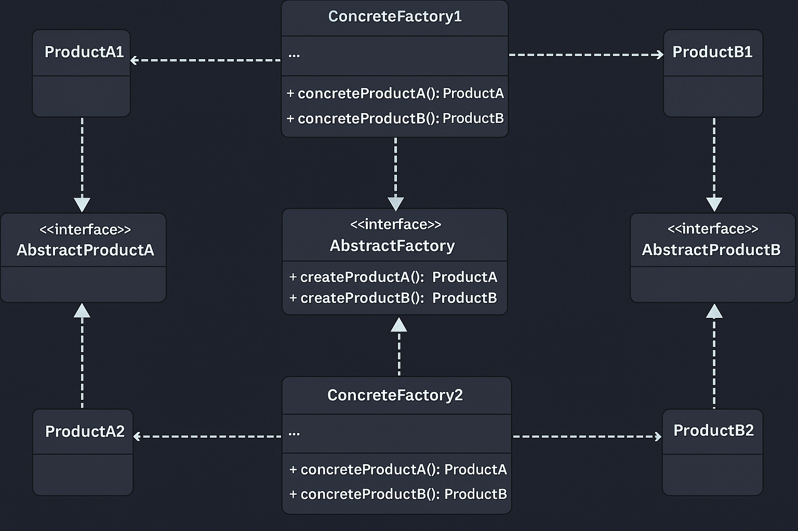

# Abstract Factory Pattern — Payment Platform Ecosystem

This example demonstrates the **Abstract Factory Design Pattern** from the **Creational Design Patterns** family using a *payment platform ecosystem* scenario.

Abstract Factory states that:

> **Provide an interface for creating families of related or dependent objects without specifying their concrete classes.**

In simple terms:  
➡️ A Factory of Factories — an abstraction that allows you to create related objects (like `Payment` and `Notification`) from the same family.

---

## 🚫 Violation (Problem)

In the violation version, the client directly creates payment and notification objects:

```java
PaymentService upi = new UPIPayment();
NotificationService sms = new SMSNotification();
```

This leads to:

- Tight coupling between client and concrete classes  
- Violates **Open/Closed Principle (OCP)** and **Dependency Inversion Principle (DIP)**  
- Code duplication and hard-coded dependencies  
- Difficult to switch between product families (e.g., Domestic ↔ International)

---

## ✅ Abstract Factory-Compliant Solution

We define an **abstract factory interface** that declares creation methods for each product type.  
Concrete factories implement these interfaces to create product families (e.g., Domestic or International).

| Concern | Implementation | Description |
|----------|----------------|-------------|
| Product Interfaces | `PaymentService`, `NotificationService` | Define generic behaviors for related product types |
| Concrete Products | `UPIPayment`, `PayPalPayment`, `SMSNotification`, `EmailNotification` | Implement product interfaces |
| Abstract Factory | `PaymentPlatformFactory` | Declares factory methods for creating related products |
| Concrete Factories | `DomesticFactory`, `InternationalFactory` | Implement abstract factory to create consistent product families |
| Client | `Client.java` | Uses abstract factories to create families without knowing concrete classes |

---

## 🧠 UML Reference



---

## 👌 Benefits of This Design

- ✅ Loose coupling between families of objects and client code  
- ✅ Consistency: ensures compatible products are created together  
- ✅ Scalability: add new product families easily without modifying client code  
- ✅ Adheres to **OCP** and **DIP**  
- ✅ Simplifies switching between product families dynamically  

---

## 📦 How It Works

`Client.java`:

1. Chooses an appropriate factory (e.g., `DomesticFactory` or `InternationalFactory`)  
2. Calls `createPaymentService()` and `createNotificationService()` on that factory  
3. Executes the operations on returned objects (polymorphism in action)  
4. No need to modify client code for new product families  

---

## 🧪 Test Output

```
---- Domestic Platform ----
🏦 Creating Domestic Payment Service...
🏦 Creating Domestic Notification Service...
💰 Domestic: UPI Payment of ₹500
📱 Domestic SMS: Domestic payment of ₹500 completed.

---- International Platform ----
🏦 Creating International Payment Service...
🏦 Creating International Notification Service...
🌍 International: PayPal Payment of $10
📧 International Email: International payment of $10 completed.
```

All families of products (Domestic, International) work independently yet uniformly — without modifying the client.

---

## 🛑 Common Interview Traps

- ❌ Confusing **Factory Method** with **Abstract Factory**  
  → Factory Method creates *one product*, Abstract Factory creates *families* of related products.  
- ❌ Thinking it’s overengineering — it’s essential for scalable frameworks.  
- ❌ Forgetting that Abstract Factory internally uses Factory Methods.  
- ❌ Hardcoding dependencies inside the factory instead of abstracting them.  

---

## ✅ When to Use

Use Abstract Factory when:  
- You need to create **multiple related products** (families).  
- Your system should be **configurable for multiple environments** (e.g., domestic vs international).  
- You want to **ensure product compatibility** between created objects.  

Avoid when:  
- You only have one product type.  
- Product relationships are not relevant.  

---

## 🏁 One-Liner Summary

> The Abstract Factory Pattern lets you produce families of related objects without knowing their concrete classes — promoting flexibility, scalability, and consistency across systems.

---

Happy coding! 🚀
