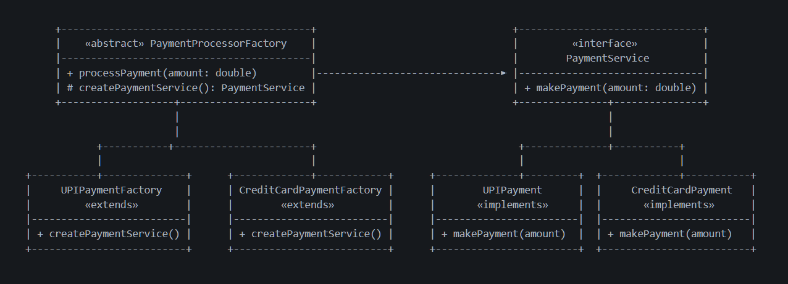

# Factory Method Pattern — Payment Processor Example

This example demonstrates the **Factory Method Design Pattern** from the **Creational Design Patterns** family using a *payment processing system* scenario.

Factory Method states that:

> **Define an interface for creating an object, but let subclasses decide which class to instantiate.**

In simple terms:  
➡️ The client doesn’t create objects directly. Instead, it delegates creation to **specialized factory subclasses** that decide which concrete class to instantiate.

---

## 🚫 Violation (Problem)

In the earlier **Simple Factory** or direct instantiation model, the client created payment types manually using:

```java
new UPIPayment();
new CreditCardPayment();
```

This leads to:

- Tight coupling between client and concrete classes  
- Violation of the **Open/Closed Principle (OCP)** — every new payment type required client modification  
- Harder testing and maintenance  
- Duplication of object creation logic  

---

## ✅ Factory-Compliant Solution

We delegate object creation to dedicated **factory subclasses** that implement a shared factory method.

| Concern | Implementation | Description |
|----------|----------------|-------------|
| Product Interface | `PaymentService` | Defines generic `makePayment()` behavior |
| Concrete Products | `UPIPayment`, `CreditCardPayment` | Implement product interface |
| Creator | `PaymentProcessorFactory` (abstract class) | Declares `createPaymentService()` |
| Concrete Creators | `UPIPaymentFactory`, `CreditCardPaymentFactory` | Override the factory method to decide which payment object to create |
| Client | `Client.java` | Requests payment processing without knowing concrete classes |

This design ensures that:
- The client depends only on **abstraction**
- New payment types can be added easily by creating a new factory subclass  
- Core factory logic (`processPayment`) remains reusable  

---

## 🧠 UML Reference



---


## 👌 Benefits of This Design

- ✅ Loose coupling between creator and concrete classes  
- ✅ Easy scalability (new payment types = new factory subclasses)  
- ✅ Shared high-level creation logic in abstract class  
- ✅ Adheres to **Open/Closed** and **Dependency Inversion** principles  
- ✅ Easier unit testing and mocking (factories can be replaced)

---

## 📦 How It Works

`Client.java`:

1. Declares abstract reference `PaymentProcessorFactory`
2. Initializes specific factories (`UPIPaymentFactory`, `CreditCardPaymentFactory`)
3. Calls `processPayment()` which internally uses `createPaymentService()`
4. Each subclass decides which payment object to instantiate
5. Client stays unaware of the specific product classes

---

## 🧪 Test Output

```
🏦 Creating UPI Payment Service...
💸 Processing ₹2000 using UPI Payment.
--------------------------
🏦 Creating Credit Card Payment Service...
💳 Processing ₹5000 using Credit Card Payment.
```

All payments are processed via the correct concrete factory —  
no direct object creation from the client.

---

## 🛑 Common Interview Traps

- ❌ Confusing *Simple Factory* (static method) with *Factory Method* (inherited subclassing).  
- ❌ Forgetting to use an **abstract creator class**.  
- ❌ Thinking Factory is only for object creation — it also adds polymorphic behavior.  
- ❌ Believing it’s overengineering — it’s essential for scalable frameworks (e.g., Spring Beans).  
- ❌ Not recognizing `Calendar.getInstance()` and `DocumentBuilderFactory` as real-world examples.

---

## ✅ When to Use

Use Factory Method when:
- The exact product class isn’t known until runtime.  
- You want to provide a hook for subclasses to choose object types.  
- You expect frequent extension (new product families).

Avoid when:
- The object creation logic is simple or static.  
- You have only one type of product (no need for subclassing).

---

## 🏁 One-Liner Summary

> Factory Method Pattern delegates object creation to subclasses, ensuring loose coupling, extensibility, and clean adherence to OCP.

---

Happy coding! 🚀
