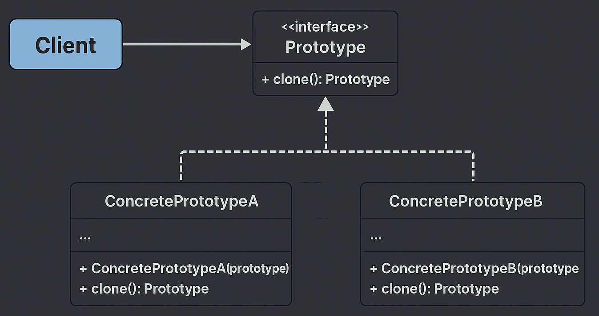

# Prototype Pattern — Document / Report Template System

This example demonstrates the **Prototype Design Pattern** from the **Creational Design Patterns** family using a *Report Template System* scenario.

Prototype Pattern states that:

> **Specify the kinds of objects to create using a prototypical instance, and create new objects by copying this prototype.**

In simple terms:  
➡️ Instead of creating new objects from scratch, we **clone existing templates (prototypes)** to save initialization cost and ensure consistency.

---

## 🚫 Violation (Problem)

In the earlier implementation, every new report object was created manually:

```java
new FinancialReport("Q1 Report", "Finance Dept", "2025-Q1");
new FinancialReport("Q2 Report", "Finance Dept", "2025-Q2");
```

This leads to:

- Heavy object creation cost (each report reinitializes headers, footers, metadata)
- Redundant setup logic across reports
- Violates the **DRY principle** (repeated configuration)
- Slower performance when large objects are repeatedly initialized

---

## ✅ Prototype-Compliant Solution

We define a **Prototype Interface** (`ReportPrototype`) that declares a cloning method, and concrete report classes implement it.

| Concern | Implementation | Description |
|----------|----------------|-------------|
| Prototype Interface | `ReportPrototype` | Declares `clone()` and `print()` |
| Concrete Prototypes | `FinancialReport` | Implements clone and defines data structure |
| Prototype Registry | `ReportRegistry` | Stores and returns clones on demand |
| Client | `Client.java` | Requests cloned objects from the registry instead of creating new ones |

This design ensures:
- Reuse of preconfigured templates (reduces initialization cost)
- Centralized control over report configurations
- Clean adherence to **Open/Closed Principle** (new report types just implement `ReportPrototype`)

---

## 🧠 UML Reference



---

## 👌 Benefits of This Design

- ✅ Efficient object creation (no repeated setup logic)  
- ✅ Cloned objects preserve structure but can be modified independently  
- ✅ Centralized registry for prototypes  
- ✅ Adheres to **OCP** and **DRY** principles  
- ✅ Ideal for systems with heavy or complex initialization logic  

---

## 📦 How It Works

`Client.java`:

1. Registers base templates in `ReportRegistry`.
2. Requests clones using keys (e.g., `"FinancialReport"`).
3. Customizes cloned reports with runtime data (e.g., period, department).
4. Executes `print()` to display data.  

```java
ReportRegistry registry = new ReportRegistry();
registry.register("FinancialReport", baseFinance);

FinancialReport q1Report = (FinancialReport) registry.getClone("FinancialReport");
q1Report.print();
```

---

## 🧪 Test Output

```
📄 Cloning Financial Report...
=== Q1 Report ===
Created By: Finance Dept
Period: 2025-Q1
[Company Header]
... [Report Content] ...
[Confidential Footer]
```

---

## 🛑 Common Interview Traps

- ❌ Confusing **Prototype** with **Factory** — Prototype copies existing objects; Factory builds new ones.  
- ❌ Ignoring **deep copy vs shallow copy** — forgetting to duplicate nested mutable objects.  
- ❌ Using `clone()` without handling exceptions or proper deep copy logic.  
- ❌ Treating it as an unnecessary pattern — it’s critical when object creation is expensive (e.g., reports, game entities, or configuration objects).  

---

## ✅ When to Use

Use Prototype when:
- Object creation is **costly or time-consuming**.  
- You need to create many similar objects that share configuration.  
- You maintain **a registry of reusable templates**.

Avoid when:
- Objects are lightweight and easy to construct.  
- Deep copying is complex or error-prone.  

---

## 🏁 One-Liner Summary

> Prototype Pattern creates new objects by cloning preconfigured prototypes, making it ideal for systems where object creation is expensive or repetitive.

---

Happy coding! 🚀
