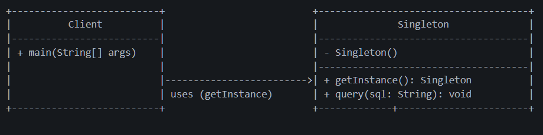

# Singleton Pattern — Database Connection Manager

This example demonstrates the **Singleton Design Pattern** from the Creational Design Patterns family using a *Database connection system* scenario.

Singleton states that:

> **A class should have only one instance and provide a global point of access to it.**

---

## 🚫 Violation (Problem)

In the violation version, multiple `DatabaseConnection` instances are created:

- Each module calls `new DatabaseConnection()`
- Each creates a new connection object
- Resources and states become inconsistent

When this happens:
- Connection pool overflows
- Data inconsistencies may occur
- Memory and synchronization overhead increase

This leads to:

- Resource mismanagement  
- Uncontrolled object creation  
- Harder debugging  
- Inconsistent system state  

---

## ✅ Singleton-Compliant Solution

We make sure that only **one instance** of `DatabaseConnection` exists throughout the application.

Responsibilities are controlled through static access:

| Concern | Implementation | Description |
|----------|----------------|-------------|
| Instance Control | Private constructor | Prevents new object creation |
| Single Access | Static `getInstance()` method | Central access point |
| Thread Safety | `synchronized` or `volatile` | Ensures no race conditions |
| Global Availability | Shared static instance | Same object across modules |

---

## 🧠 UML (Simplified)



---

### 🧩 Types of Singleton Implementations

| Type | Thread-Safe | Lazy | Description |
|------|--------------|------|-------------|
| **Eager Initialization** | ✅ | ❌ | Instance created at class load time. Simple and reliable. |
| **Static Block Initialization** | ✅ | ❌ | Similar to eager but allows exception handling during instantiation. |
| **Lazy Initialization** | ❌ | ✅ | Instance created on first call. Not thread-safe. |
| **Thread Safe Initialization** | ✅ | ✅ | Uses synchronized getInstance(). Simple but slower due to method-level locking. |
| **Double-Checked Locking (DCL)** | ✅ | ✅ | Uses `volatile` and sync block. Efficient and safe. |
| **Initialization-on-Demand Bill Pugh** | ✅ | ✅ | JVM handles thread safety. Recommended in most cases. |
| **Enum Singleton** | ✅ | ❌ | Simplest and safest (serialization & reflection safe). |

---

## 👌 Benefits of This Design

- Ensures single, consistent instance across app  
- Reduces connection pool overload  
- Centralizes resource management  
- Simplifies debugging and maintenance  
- Improves performance and reliability  

---

## 📦 How It Works

`Client.java`:

1. Requests instance via `DatabaseConnection.getInstance()`  
2. Reuses same instance for all operations  
3. Executes queries consistently through shared connection  

---

## 🧪 Test Output

```
Eager DB connection established.
Holder DB connection established.
true
true
true
true
true
true
true
HOLDER executing: SELECT * FROM users;
```

All `true` values confirm that the same instance is returned every time.

---

## 🛑 Common Interview Traps

- Forgetting to make constructor private ❌  
- “Singleton = all static methods” ❌  
- “Lazy init without sync is fine” ❌  
- “Enum Singleton is strange” ❌ (It’s the safest in Java)  
- Overusing Singleton for convenience ❌ (leads to global state issues)

---

## ✅ When to Use

Use Singleton when:
- Managing a shared global resource (DB, Logger, Config)
- Ensuring one access point to a critical service
- Controlling connection-heavy or stateful services

Avoid Singleton when:
- Multiple instances are needed
- You require independent testable components
- You’re working in distributed systems (per-JVM limit)

---

## 🏁 One-Liner Summary

> Singleton ensures only one instance of a class exists and provides a single access point — ideal for shared system-wide resources.

---

Happy coding! 🚀