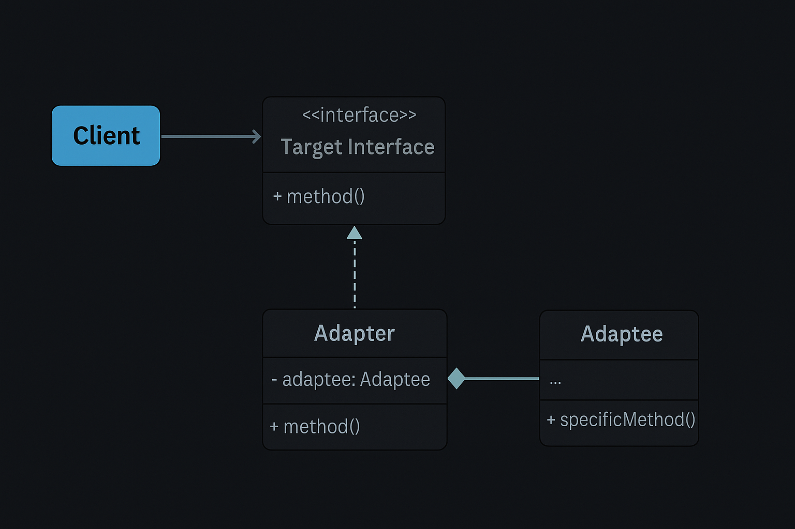

# Adapter Pattern — Payment Gateway Adapter Example

This example demonstrates the **Adapter Design Pattern** from the **Structural Design Patterns** family using a *Payment Gateway Integration* scenario.

Adapter Pattern states that:

> **Convert the interface of a class into another interface clients expect. Adapter lets classes work together that couldn't otherwise because of incompatible interfaces.**

In simple terms:  
➡️ The application expects a stable `PaymentGateway` interface. Third-party SDKs expose different methods. We build adapters that translate between them so the client can use any provider transparently.

---

## 🚫 Violation (Problem)

In a tightly coupled model, client code directly calls third-party SDKs:

```java
PayPalAPI payPal = new PayPalAPI();
payPal.makePayment(9999);

RazorPayAPI razor = new RazorPayAPI();
razor.processPayment("INR", 4999);
```

This leads to:

- Code modifications whenever a new SDK is integrated.  
- Violation of **Open/Closed Principle** — adding providers requires client changes.  
- Scattered SDK-specific logic and harder testing.  

---

## ✅ Adapter-Compliant Solution

We introduce a **Target Interface** (`PaymentGateway`) that the application uses, and create **Adapter** classes that translate calls to third-party SDKs.

| Concern | Implementation | Description |
|---------|----------------|-------------|
| Target Interface | `PaymentGateway` | Application-level abstraction with `pay(double amount)` |
| Adaptees (SDKs) | `PayPalAPI`, `RazorPayAPI` | Third-party classes with incompatible APIs |
| Adapters | `PayPalAdapter`, `RazorPayAdapter` | Implement `PaymentGateway` and delegate to Adaptees |
| Client | `PaymentProcessor`, `Client` | Use `PaymentGateway` only — decoupled from SDKs |

This design ensures:
- The application depends only on abstractions.  
- New providers are added by creating adapters—not touching client code.  
- Easier unit testing and mocking of `PaymentGateway`.

---

## 🧠 UML Reference



---

## 👌 Benefits of This Design

- ✅ Decouples application code from third-party SDKs.  
- ✅ Adheres to **Open/Closed** and **Dependency Inversion** principles.  
- ✅ Simple to add or remove providers by adding/removing adapters.  
- ✅ Improves testability — mock `PaymentGateway` in unit tests.

---

## 📦 How It Works

`Client.java` (Solution):

1. Create Adaptee instances (e.g., `PayPalAPI`, `RazorPayAPI`).  
2. Wrap them with Adapters that implement `PaymentGateway`.  
3. Inject adapters into `PaymentProcessor`.  
4. Call `checkout(amount)` — the adapter translates and invokes SDK methods.

```java
PaymentGateway payPalGateway = new PayPalAdapter(new PayPalAPI());
PaymentProcessor processor = new PaymentProcessor(payPalGateway);
processor.checkout(99.99);
```

---

## 🧪 Test Output

```
[PaymentProcessor] Checkout amount: 99.99
[PayPalAdapter] Adapting pay(99.99) -> makePayment(9999)
[PayPalAPI] Processing payment of $99.99
--------------------------
[PaymentProcessor] Checkout amount: 49.99
[RazorPayAdapter] Adapting pay(49.99) -> processPayment(INR, 4999)
[RazorPayAPI] Processing payment of INR 49.99
```

---

## 🛑 Common Interview Traps

- ❌ Confusing **Adapter** with **Facade** — Adapter translates interfaces; Facade simplifies a subsystem.  
- ❌ Using Adapter to add business logic; keep adapters thin.  
- ❌ Not isolating third-party dependencies behind adapters (causes leak of SDK specifics).  

---

## ✅ When to Use

Use Adapter when:
- You must integrate third‑party or legacy code with incompatible interfaces.  
- You cannot change the client or the existing SDKs.  
- You want a clean layer isolating external dependencies.

Avoid when:
- You control both interfaces and can refactor them.  
- The translation overhead is large and better handled by other patterns (e.g., Facade).

---

## 🏁 One-Liner Summary

> Adapter Pattern converts the interface of third-party SDKs into the interface your application expects, enabling seamless integration without changing client code.

---

Happy coding! 🚀
