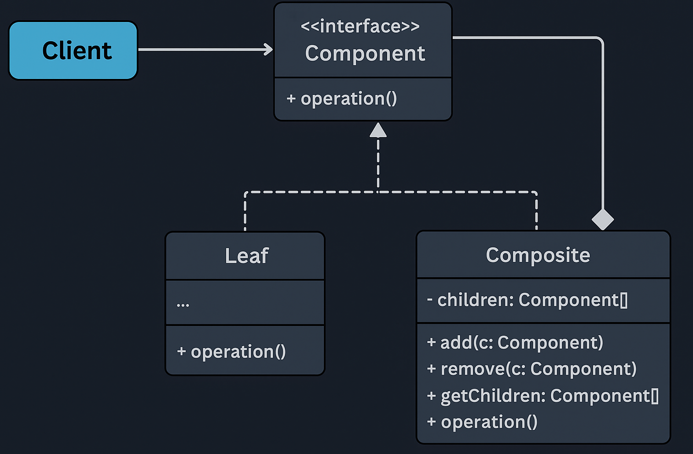

# Composite Pattern — E-Commerce Product Catalog Example

This example demonstrates the **Composite Design Pattern** from the **Structural Design Patterns** family using an *E-Commerce Product Catalog* scenario.

Composite Pattern states that:

> **Compose objects into tree structures to represent part–whole hierarchies. Composite lets clients treat individual objects and compositions uniformly.**

In simple terms:  
➡️ Products and Categories should be handled the same way using a common abstraction (`CatalogComponent`).

---

## 🚫 Violation (Problem)

In a naive, tightly coupled model, the client handles products and categories differently:

```java
Category laptops = new Category("Laptops");
laptops.addProduct(new Product("MacBook Pro", 180000));
laptops.addProduct(new Product("Dell XPS", 150000));

laptops.printCategory();   // Works
// But cannot contain subcategories
```

This leads to:

- No uniform abstraction for categories and products  
- Client must manually traverse product lists  
- Cannot nest categories inside categories  
- Violates **Open/Closed Principle** — adding new hierarchy types requires modifying client code  
- Breaks **Single Responsibility** — client manages traversal logic  

---

## ✅ Composite-Compliant Solution

We introduce a **Component interface** (`CatalogComponent`) implemented by both `Product` (Leaf) and `Category` (Composite).

| Concern | Implementation | Description |
|--------|----------------|-------------|
| Component | `CatalogComponent` | Common abstraction for `showDetails()` |
| Leaf | `Product` | Represents indivisible products |
| Composite | `Category` | Holds both Products and other Categories |
| Client | `Client.java` | Operates on `CatalogComponent` uniformly |

This design ensures:

- Uniform treatment of single objects and groups  
- Unlimited hierarchical depth  
- Recursive traversal handled internally  
- Open/Closed compliance (adding new node types requires no client change)

---

## 🧠 UML Reference



---

## 👌 Benefits of This Design

- ✅ Treat products and categories uniformly  
- ✅ Easily supports subcategories and deep hierarchies  
- ✅ Removes traversal logic from the client  
- ✅ Cleaner, scalable catalog representation  
- ✅ Aligns with SRP, OCP, and DIP principles  

---

## 📦 How It Works

`Client.java` (Solution):

1. Create leaf nodes (`Product`).  
2. Create composite nodes (`Category`).  
3. Add products and categories into other categories.  
4. Call `showDetails()` on the root category.  
5. Composite internally performs recursive traversal.

```java
Category electronics = new Category("Electronics");
Category laptops = new Category("Laptops");

laptops.add(new Product("MacBook Pro", 180000));
laptops.add(new Product("Dell XPS", 150000));

electronics.add(laptops);
electronics.showDetails();
```

---

## 🧪 Test Output

```
Category: Electronics
Category: Laptops
Product: MacBook Pro | ₹180000.0
Product: Dell XPS | ₹150000.0
```

---

## 🛑 Common Interview Traps

- ❌ Confusing **Composite** with **Decorator** — Composite handles hierarchies, Decorator adds behavior  
- ❌ Forgetting that both Leaf and Composite must share a common interface  
- ❌ Adding type-checks (`instanceof`) in client code — violates the pattern  
- ❌ Implementing storage logic (add/remove) in Leaf classes — should only exist in Composite  

---

## ✅ When to Use

Use Composite when:

- You model hierarchical data (menu → submenu → items)  
- You need consistent operations across single and grouped objects  
- You want to delegate traversal to the structure itself  

Avoid when:

- Hierarchies are flat and simple  
- You need strict type separation between product types  

---

## 🏁 One-Liner Summary

> Composite Pattern lets you build tree structures of objects and treat individual items and groups uniformly using a common abstraction.

---

Happy coding! 🚀
