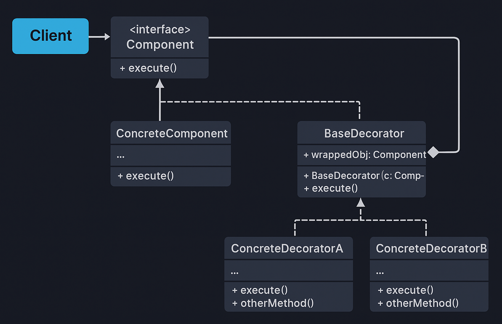

# Decorator Pattern — E-Commerce Order Pricing Example

This example demonstrates the **Decorator Design Pattern** from the **Structural Design Patterns** family using an *E-Commerce Order Pricing System* scenario.

Decorator Pattern states that:

> **Attach additional responsibilities to an object dynamically. Decorators provide a flexible alternative to subclassing for extending functionality.**

In simple terms:  
➡️ Instead of creating many subclasses for combinations of features (gift wrap + express + discount), we **wrap** an object with decorators that each add one responsibility.

---

## 🚫 Violation (Problem)

A naive subclass approach creates many specific subclasses to represent combinations:

```java
class GiftWrappedOrder extends BasicOrder { ... }
class ExpressShippingOrder extends BasicOrder { ... }
class DiscountedOrder extends BasicOrder { ... }
// Combinations require more subclasses -> explosion
```

This leads to:
- Class explosion and maintenance overhead.  
- Rigid design and poor scalability.  
- Violates **Open/Closed Principle** — adding features requires new subclasses.

---

## ✅ Decorator-Compliant Solution

We define a **Component** interface (`Order`) and use **Decorators** to add behaviors at runtime.

| Concern | Implementation | Description |
|---------|----------------|-------------|
| Component | `Order` | Interface with `getCost()` and `getDescription()` |
| Concrete Component | `BasicOrder` | Base implementation |
| Decorator | `OrderDecorator` | Abstract decorator wrapping `Order` |
| Concrete Decorators | `GiftWrapDecorator`, `ExpressShippingDecorator`, `DiscountDecorator`, `TaxDecorator` | Add cost/behavior dynamically |
| Client | `Client.java` | Combines decorators at runtime to compute final price |

This design ensures:
- Flexible feature composition at runtime.  
- Avoids subclass explosion.  
- Clear separation of concerns — each decorator has single responsibility.

---

## 🧠 UML Reference



---

## 👌 Benefits of This Design

- ✅ Dynamic addition of responsibilities.  
- ✅ Avoids combinatorial subclassing.  
- ✅ Each decorator focuses on a single concern.  
- ✅ Order of decorators controls final behavior (important nuance).

---

## 📦 How It Works

`Client.java` (Solution):

1. Start with a `BasicOrder` (base price).  
2. Wrap it with decorators, e.g., `new GiftWrapDecorator(order)` or `new DiscountDecorator(order, 10)`.  
3. Each decorator modifies `getCost()` and `getDescription()` based on the wrapped object.  
4. Final `getCost()` is computed by sequentially applying decorator logic.

```java
Order order = new DiscountDecorator(
                new ExpressShippingDecorator(
                    new GiftWrapDecorator(
                        new BasicOrder(1000.0))));
System.out.println(order.getCost());
```

---

## 🧪 Test Output

```
Basic Order, 10.0% Discount Applied, Tax 18.0%, Gift Wrapped -> ₹1115.1
Basic Order, Tax 18.0%, 10.0% Discount Applied, Gift Wrapped -> ₹1112.0
Basic Order, Gift Wrapped, 10.0% Discount Applied, Tax 18.0% -> ₹1115.1
Basic Order, Tax 18.0%, Gift Wrapped, 10.0% Discount Applied -> ₹1107.0
```

---

## 🛑 Common Interview Traps

- ❌ Forgetting that **order matters** — decorators are applied in sequence.  
- ❌ Creating decorators that do too much (mix business logic).  
- ❌ Using Decorator when simple composition or configuration would suffice.

---

## ✅ When to Use

Use Decorator when:
- You need to add/expose behaviors at runtime flexibly.  
- You want to avoid subclass combinations.  
- You need to provide pluggable features for objects (e.g., middleware, filters).

Avoid when:
- Simpler composition or configuration solves the problem.  
- Performance critical code where layered calls add overhead.

---

## 🏁 One-Liner Summary

> Decorator Pattern lets you compose behaviors at runtime by wrapping objects with lightweight decorators, avoiding subclass explosion and increasing flexibility.

---

Happy coding! 🚀
