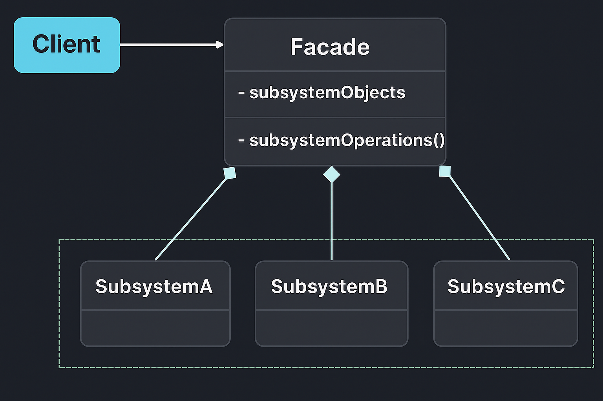

# Facade Pattern — E-Commerce Order Placement Example

This example demonstrates the **Facade Design Pattern** from the **Structural Design Patterns** family using an *E-Commerce Order Placement System*.

Facade Pattern states that:

> **Provide a unified interface to a set of interfaces in a subsystem. Facade defines a higher-level interface that makes the subsystem easier to use.**

In simple terms:  
➡️ The client interacts with **one simplified class (Facade)** instead of managing multiple subsystem classes.

---

## 🚫 Violation (Problem)

In the original design, the client directly coordinated all the subsystems:

```java
InventoryService inventory = new InventoryService();
PaymentService payment = new PaymentService();
ShippingService shipping = new ShippingService();
NotificationService notification = new NotificationService();

if (inventory.checkStock(order)) {
    if (payment.processPayment(order)) {
        shipping.shipOrder(order);
        notification.sendConfirmation(order);
    }
}
```

This leads to:
- Tight coupling between client and multiple subsystems.  
- Difficult maintenance when subsystem logic changes.  
- Violates **Single Responsibility** and **Open/Closed Principles**.  

---

## ✅ Facade-Compliant Solution

We introduce a unified **OrderFacade** class that abstracts and coordinates all subsystem interactions.

| Concern | Implementation | Description |
|----------|----------------|-------------|
| Facade | `OrderFacade` | Provides `placeOrder()` method that internally uses all subsystems |
| Subsystems | `PaymentService`, `InventoryService`, `ShippingService`, `NotificationService` | Independent modules with specific responsibilities |
| Client | `Client.java` | Uses only `OrderFacade` to place an order |

This design ensures:
- Simplified interface for clients.  
- Decoupled subsystems (independent evolution).  
- Cleaner and more maintainable architecture.  

---

## 🧠 UML Reference



---

## 👌 Benefits of This Design

- ✅ Simplifies client usage with a single entry point.  
- ✅ Improves readability and maintainability.  
- ✅ Reduces dependencies between client and subsystems.  
- ✅ Adheres to **Low Coupling, High Cohesion** principle.

---

## 📦 How It Works

`Client.java`:

1. Creates an `Order` object.  
2. Passes it to `OrderFacade.placeOrder(order)`.  
3. Facade internally calls `InventoryService`, `PaymentService`, `ShippingService`, and `NotificationService` in sequence.

```java
Order order = new Order("ORD123", "Laptop", 1, 95000.0);
OrderFacade facade = new OrderFacade();
facade.placeOrder(order);
```

---

## 🧪 Test Output

```
🛒 Starting order placement process for Laptop
📦 Checking stock for Laptop (Qty: 1)
💳 Processing payment of ₹95000.0 for Laptop
🚚 Shipping order: ORD123 for Laptop
📧 Sending confirmation email for Order ID: ORD123
✅ Order placed successfully!
```

---

## 🛑 Common Interview Traps

- ❌ Confusing **Facade** with **Adapter** — Adapter changes an interface; Facade simplifies many.  
- ❌ Overloading the Facade with too much logic — it should **delegate, not decide**.  
- ❌ Using one Facade for the entire system instead of module-level facades.

---

## ✅ When to Use

Use Facade when:
- You have a complex subsystem and want to provide a simple API to clients.  
- You want to decouple layers in your architecture (UI → Service → Data).  

Avoid when:
- The system is small or simple enough to be used directly.

---

## 🏁 One-Liner Summary

> Facade Pattern provides a simple, unified interface to a complex subsystem, making the system easier to use and maintain.

---

Happy coding! 🚀
