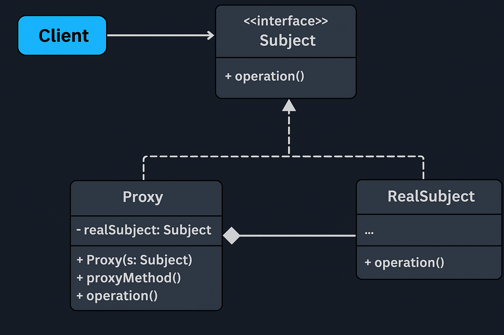

# Proxy Pattern — Comprehensive Multi-Type Industry Example

This section demonstrates **six real-world variants** of the **Proxy Design Pattern** using *different industry domains*.  
Each proxy type includes:

- **Problem Folder** → Bad design without proxy.
- **Solution Folder** → Clean proxy-based design.

The goal of this multi-example module is to give a complete, production-grade understanding of how different Proxy types work and when each one is appropriate.

---

# 🌐 What is the Proxy Pattern?

Proxy Pattern states:

> **Provide a surrogate or placeholder for another object to control access to it.**

The proxy implements the *same interface* as the real object, but acts as a gatekeeper, optimizer, or enhancements layer.

In industry, proxies appear everywhere:
- Spring AOP proxies
- Hibernate lazy-loading proxies
- API gateways
- Network stubs
- Cloud SDK wrappers
- Browser service workers
- Virtualization layers

---

# 🧩 Why Multiple Proxy Types?

Different business problems require different proxy behaviors:

| Proxy Type | Purpose | Real-World Domain Used |
|-----------|----------|------------------------|
| **Virtual Proxy** | Lazy initialization of heavy objects | PDF Report Generator |
| **Protection Proxy** | Authorization & access control | Banking Loan Approval |
| **Remote Proxy** | Access remote microservices | AI Image Processing |
| **Cache Proxy** | Cache expensive operations | E‑commerce Product Catalog |
| **Logging Proxy** | Audit & monitoring | SaaS User Activity |
| **Smart Proxy** | Resource tracking & lifecycle mgmt | File Access / OS |

Each folder demonstrates one clear behavior, following professional LLD standards.

---

# 🧠 Overview of All Proxy Types

---

## 1️⃣ Virtual Proxy — *Report Generation System*

### ❌ Problem
Heavy PDF generator initialized **even when not used** → wastes memory & CPU.

### ✅ Solution
`ReportGeneratorProxy` delays creation of `RealReportGenerator` until `generateReport()` is called.

### Industry Use Cases
- Hibernate lazy loading
- Lazy-loaded images in UI
- Large API clients (AWS/GCP SDK)

---

## 2️⃣ Protection Proxy — *Bank Loan Approval*

### ❌ Problem
Any user can perform sensitive actions (approve loans).

### ✅ Solution
`AccountServiceProxy` ensures only `ADMIN` role can call sensitive operations.

### Industry Use Cases
- RBAC (Role-Based Access Control)
- API Gateway authorization
- Firewall access rules

---

## 3️⃣ Remote Proxy — *AI Image Processing Microservice*

### ❌ Problem
Client thinks it is calling a local service → but processing is remote.

### ✅ Solution
Proxy simulates:
- Network call
- Retry logic
- Failure handling

### Industry Use Cases
- REST API client stubs
- gRPC stubs
- Cloud SDK (AWS/GCP/Azure)

---

## 4️⃣ Cache Proxy — *E‑commerce Product Catalog*

### ❌ Problem
Repeated DB calls for same SKU → slow UI & DB overload.

### ✅ Solution
`ProductCatalogCacheProxy` caches results in-memory.

### Industry Use Cases
- Redis API wrappers
- CDN caching layers
- Internal service caching

---

## 5️⃣ Logging Proxy — *User Activity Tracking*

### ❌ Problem
No centralized audit logging → violates compliance (SOC2, GDPR).

### ✅ Solution
`ActivityLoggingProxy` wraps every service call with audit logs.

### Industry Use Cases
- Audit logs in banking/healthcare
- APM (Application Performance Monitoring)
- Event sourcing

---

## 6️⃣ Smart Proxy — *File Access (Resource Management)*

### ❌ Problem
File handles opened by clients may not close → resource leaks.

### ✅ Solution
`FileAccessorSmartProxy` tracks reference counts  
Automatically closes file when no references remain.

### Industry Use Cases
- Smart pointers in C++
- Database connection pools
- Auto resource management layers

---

# 🧠 UML Reference

---

# 🙌 Benefits Across All Proxy Types

- ✔ Improved security  
- ✔ Better performance (caching, lazy loading)  
- ✔ Cleaner architecture  
- ✔ Separation of concerns  
- ✔ Centralized cross-cutting features (logging, auth)  
- ✔ Eliminates duplicate logic in clients  
- ✔ Swappable implementations (DIP-compliant)

---

# 🛑 Common Interview Traps

- ❌ Confusing **Proxy vs Decorator**  
  - Proxy controls access  
  - Decorator adds behavior dynamically

- ❌ Confusing **Remote Proxy vs Adapter**  
  - Remote Proxy hides network communication  
  - Adapter converts interface

- ❌ Thinking Proxy = only for lazy loading  
  Proxy solves **six** different classes of problems.

- ❌ Adding business logic in proxies  
  Keep proxies *lightweight*—only cross-cutting concerns.

---
## ✅ When to Use

Use the Proxy Pattern when:
- You need control over access to a real object (authorization, rate limiting, validation).  
- The real object is expensive to create, and you want lazy initialization (Virtual Proxy). 
- The real object resides on a different machine or network (Remote Proxy).
- You want to add cross-cutting concerns like logging, caching, metrics, or auditing without modifying the real class.
- You need resource tracking or lifecycle management (Smart Proxy).
- You want a clean separation between client and real service, following DIP

Avoid when:
- The access control or cross-cutting logic is business logic, not infrastructural — use Decorator instead.
- The only issue is interface incompatibility — use Adapter or Facade.
- You control all code and can refactor the system directly (proxy adds unnecessary indirection).
- Overhead of extra method calls is critical (e.g., in extremely high-frequency trading systems).
- The real-object operations are trivial, and proxy doesn’t add meaningful value.  

---
# 🏁 One-Liner Summary

> Proxy Pattern provides a stand‑in object that controls access to another object, enabling lazy loading, authorization, caching, logging, remote invocation, or resource management — all without modifying the client or the real object.

---

Happy coding! 🚀  
