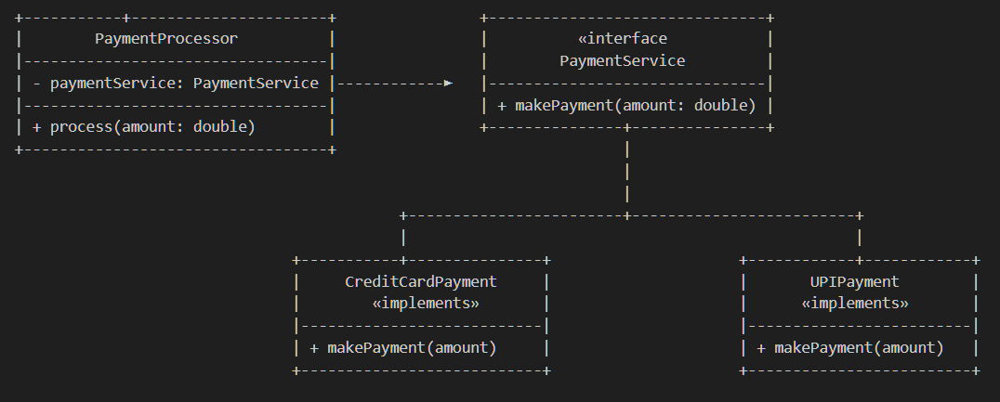

# Dependency Inversion Principle (DIP) — Payment Processing System

This example demonstrates the **Dependency Inversion Principle (DIP)** from the SOLID design principles using a **Payment Processing System**.

DIP states that:

> **High-level modules should not depend on low-level modules. Both should depend on abstractions.**

---

## 🚫 Violation (Problem)

In the violation version, the `PaymentProcessor` (high-level module) directly depends on `CreditCardPayment` (low-level module).

| Module | Type | Problem |
|--------|------|----------|
| `PaymentProcessor` | High-level | Depends on concrete `CreditCardPayment` class |
| `CreditCardPayment` | Low-level | No abstraction layer, tightly coupled |

When a new payment type (like UPI or PayPal) needs to be added,  
the high-level `PaymentProcessor` class must be modified — breaking the **Open/Closed Principle** and **DIP**.

---

## ✅ DIP-Compliant Solution

We introduce an **abstraction (`PaymentService`)** between high-level and low-level modules.

| Responsibility | Class / Interface | Reason to Change |
|----------------|-------------------|------------------|
| Define payment contract | `PaymentService` | When payment method behavior changes |
| Handle credit card payments | `CreditCardPayment` | Card logic or gateway changes |
| Handle UPI payments | `UPIPayment` | UPI API or logic changes |
| Process payments | `PaymentProcessor` | Business flow changes only |

Now both `PaymentProcessor` (high-level) and payment implementations (low-level) depend on the same abstraction.

---

### 💡 How This Fixes the Problem

- `PaymentProcessor` doesn’t know about the concrete payment types.  
- New payment methods can be added without modifying existing code.  
- Code is **testable**, **modular**, and **flexible**.

---

## 👌 Benefits of This Design

- ✅ High-level modules are independent of implementation details  
- ✅ Easy to extend with new payment methods  
- ✅ Works seamlessly with dependency injection frameworks (Spring, Guice, etc.)  
- ✅ Fully aligns with SRP, OCP, and DIP  

---

## 📦 How It Works

**`ClientMain.java`:**
1. Creates `PaymentService` instances (`CreditCardPayment`, `UPIPayment`)  
2. Passes them to `PaymentProcessor` (constructor injection)  
3. `PaymentProcessor` processes payments without knowing *how* they’re done  

---

## 🧠 UML (Simplified)

---

## 🛑 Common Interview Traps

| Misconception | Why It’s Wrong |
|----------------|----------------|
| “DIP = Dependency Injection” | ❌ Injection is one *way* to apply DIP, not the principle itself |
| “DIP means all classes use interfaces” | ❌ Only when abstraction adds value |
| “DIP is only for frameworks like Spring” | ❌ It’s a design principle, not framework-specific |

---

## ✅ When to Use

Use DIP when:
- High-level classes depend directly on low-level modules  
- Code changes ripple across layers  
- Unit testing is difficult due to tight coupling  

---

## 🏁 One-Liner Summary

> DIP ensures both high-level and low-level modules depend on abstractions — not each other — making systems flexible and maintainable.

---

Happy coding! 🚀
