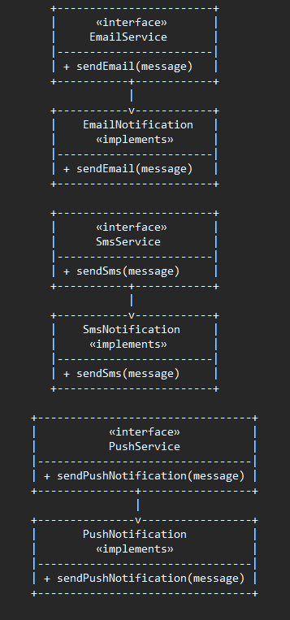

# Interface Segregation Principle (ISP) — Notification Service System

This example demonstrates the **Interface Segregation Principle (ISP)** from the SOLID design principles using a real-world **Notification Service System**.

ISP states that:

> **Clients should not be forced to depend on methods they do not use.**

---

## 🚫 Violation (Problem)

In the violation version, the `NotificationService` interface combines **email, SMS, and push** methods into one large interface.

| Class | Supported Method | Forced Methods | Problem |
|--------|------------------|----------------|----------|
| `EmailNotification` | `sendEmail()` | `sendSms()`, `sendPushNotification()` | Throws UnsupportedOperationException |
| `SmsNotification` | `sendSms()` | `sendEmail()`, `sendPushNotification()` | Throws UnsupportedOperationException |

This violates **ISP** because:
- Classes are forced to depend on methods they don’t use.
- Clients can mistakenly call unsupported methods.
- Code becomes brittle and unsafe to extend.

---

## ✅ ISP-Compliant Solution

We split large interfaces into **smaller, role-specific ones**:

| Capability | Interface | Example Class |
|-------------|------------|----------------|
| Email notification | `EmailService` | `EmailNotification` |
| SMS notification | `SmsService` | `SmsNotification` |
| Push notification | `PushService` | `PushNotification` |

Now, each class implements only the methods it actually supports.

---

### 💼 Responsibilities Table

| Responsibility | Class / Interface | Reason to Change |
|----------------|-------------------|------------------|
| Send Email notifications | `EmailService`, `EmailNotification` | Email sending logic changes |
| Send SMS notifications | `SmsService`, `SmsNotification` | SMS gateway or format changes |
| Send Push notifications | `PushService`, `PushNotification` | Push channel or token logic changes |

---

### 💡 How This Fixes the Problem

- No class implements irrelevant methods.  
- Clients depend only on what they use.  
- No `UnsupportedOperationException` ever needed.  
- Interfaces reflect *true capabilities*, not assumptions.

---

## 👌 Benefits of This Design

- ✅ High cohesion (each interface has a focused role)
- ✅ Reduced coupling (no forced dependencies)
- ✅ Better maintainability
- ✅ Easier testing and mocking
- ✅ Extensible — new notification types can be added easily

---

## 📦 How It Works

**`ClientMain.java` (Solution)**:
1. Each service handles one communication channel.
2. Clients depend only on required interfaces.
3. Adding new channels (like WhatsApp) doesn’t affect others.

---

## 🧠 UML (Simplified)

---

## 🛑 Common Interview Traps

| Misconception | Why It’s Wrong |
|----------------|----------------|
| “ISP means small interfaces only” | ❌ It means *role-specific* interfaces |
| “One interface per class” | ❌ Overkill — just separate based on responsibility |
| “It’s fine to throw UnsupportedOperationException” | ❌ That’s a design smell |
| “ISP is optional” | ❌ It’s critical for scalable, modular systems |

---

## ✅ When to Use

Use ISP when:
- A class is forced to implement irrelevant methods  
- Clients depend on too many unused behaviors  
- You see “UnsupportedOperationException” patterns  

---

## 🏁 One-Liner Summary

> ISP ensures interfaces are focused, clients are independent, and code remains modular and extendable.

---

Happy coding! 🚀
