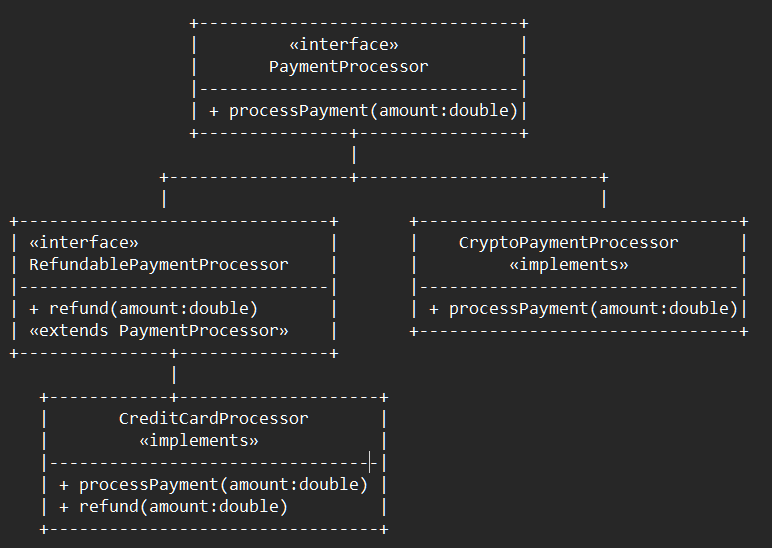

# Liskov Substitution Principle (LSP) — Payment Processing System

This example demonstrates the **Liskov Substitution Principle (LSP)** from the SOLID design principles using a real-world **Payment Processing System**.

LSP states that:

> **Subclasses must be substitutable for their base classes without altering the correctness of the program.**

---

## 🚫 Violation (Problem)

In the violation version, the `PaymentProcessor` base class assumes that **all payment types can both process and refund payments**.

| Class | Behavior | Problem |
|--------|-----------|----------|
| `CreditCardProcessor` | Supports payments and refunds | ✅ Works fine |
| `CryptoPaymentProcessor` | Supports only payments | ❌ Throws `UnsupportedOperationException` when refund is called |

When a `CryptoPaymentProcessor` object is used as a `PaymentProcessor`, it **breaks the expected contract** — the client code assumes `refund()` is always valid.  
This violates **LSP**, as not all subclasses behave correctly when substituted for their base class.

---

### ❌ Results of Violation

- Unexpected runtime errors  
- Broken polymorphism  
- Incorrect abstraction  
- Hard-to-extend system  

---

## ✅ LSP-Compliant Solution

We separate **capabilities** based on actual behavior, not assumptions.

Now we define two interfaces:
- `PaymentProcessor` → for all payment types (common capability)
- `RefundablePaymentProcessor` → for those that can also handle refunds

---

### 💼 Responsibilities Table

| Responsibility | Class / Interface | Reason to Change |
|----------------|-------------------|------------------|
| Process any payment | `PaymentProcessor` | Generic payment behavior changes |
| Process payments **with refunds** | `RefundablePaymentProcessor` | Refund process or rules change |
| Handle credit card payments | `CreditCardProcessor` | Payment or refund logic for cards changes |
| Handle crypto payments | `CryptoPaymentProcessor` | Crypto transaction logic changes |

---

### 💡 How This Fixes the Problem

- `CryptoPaymentProcessor` implements **only** `PaymentProcessor` — no refund logic forced.  
- `CreditCardProcessor` implements `RefundablePaymentProcessor` — supports both.  
- No subclass violates its parent contract.  
- Substitution is always valid.  

---

## 👌 Benefits of This Design

- ✅ No unexpected runtime failures  
- ✅ Clear behavioral contracts  
- ✅ Improved code reliability  
- ✅ Easy extensibility for new processors  
- ✅ Perfect alignment with **LSP + ISP**

---

## 📦 How It Works

**`Main.java` (Solution)**:
1. Creates both `CryptoPaymentProcessor` and `CreditCardProcessor`
2. Both can process payments
3. Only `CreditCardProcessor` supports refunds
4. No runtime surprises — substitutability preserved

---

## 🧠 UML (Simplified)

---

## 🛑 Common Interview Traps

| Misconception | Why It’s Wrong |
|----------------|----------------|
| “LSP is about overriding methods” | ❌ It’s about preserving *behavioral contracts*, not just syntax |
| “Throwing exceptions in subclasses is fine” | ❌ It breaks substitutability |
| “All subclasses must have same methods” | ❌ Only same *expected behavior* |
| “LSP is only for inheritance” | ❌ It also applies to interfaces and polymorphism |

---

## ✅ When to Use

Use LSP when:
- A subclass behaves inconsistently with its parent  
- You’re forced to add `UnsupportedOperationException`  
- Inheritance is misused for capability modeling  

---

## 🏁 One-Liner Summary

> LSP ensures subclasses don’t betray the behavior promised by their parents — preserving correctness and reliability in polymorphism.

---

Happy coding! 🚀
