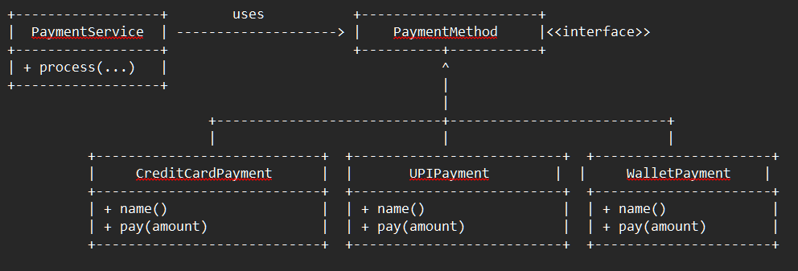

# Open/Closed Principle (OCP) — E-commerce Payment Example

This example demonstrates the **Open/Closed Principle (OCP)** from the SOLID design principles using a checkout payment scenario in an e-commerce system.

OCP states that:

> **Software entities should be open for extension, but closed for modification.**

---

## 🚫 Violation (Problem)

In the violation version, `PaymentService.processPayment()` uses a growing `if/else` block:

- `CREDIT_CARD`
- `UPI`

When business introduces new methods (Wallet, GiftCard, COD, etc.), we must:

- Edit `PaymentService`
- Add new conditional branches
- Re-test old logic
- Risk regressions

This leads to:

- Tight coupling
- Low cohesion
- Harder testing
- Frequent modifications to stable code
- Bloated `if/else` logic

---

## ✅ OCP-Compliant Solution

Responsibilities are separated using **polymorphism**:

| Responsibility | Class | Reason to Change |
|--------------|-------|------------------|
| Contract for all payment methods | `PaymentMethod` | Common behavior changes |
| Process credit card | `CreditCardPayment` | Credit card rules change |
| Process UPI | `UPIPayment` | UPI rules change |
| Look up method by key (optional) | `PaymentRegistry` | Configuration changes |
| Execute payment via abstraction | `PaymentService` | Rare orchestration changes |

Now, adding a new payment method means:
- Create a new class that implements `PaymentMethod`
- Register it in wiring/config

No existing class is modified.

---

## 👌 Benefits of This Design

- No modification to stable, tested code
- Extensible via **addition**, not modification
- Fewer regression risks in CI/CD
- Cleaner separation of concerns
- Avoids giant `if/else` or `switch` statements
- Easier to unit test individual strategies

---

## 📦 How It Works

`Checkout.java`:

1. Creates and registers payment strategies
2. Passes the strategy into `PaymentService`
3. `PaymentService` calls `method.pay(amount)` via the interface

This allows new behavior to plug-in without modifying core classes.

---

## 🧪 Testability Win

You can now test:

- `CreditCardPayment` independently
- `UPIPayment` independently
- Registry wiring separately

No more re-testing everything when adding a new method.

---

## 🧠 UML

---

## 🛑 Common Interview Traps

- Thinking OCP = “never modify code” (we protect stable modules)
- Using enums + switch and calling it “extensible”
- Adding behavior by modifying an existing class
- Believing DI is strictly required (it’s a helper, not mandatory)

---

## ✅ When to Use

Use OCP when:

- New **types** appear frequently (payment methods, discounts, taxes…)
- Business rules evolve rapidly
- You want to reduce regression blast radius

---

## 🏁 One-Liner Summary

> With OCP, you add behavior by creating new classes — not by editing old, stable ones.

---

Happy coding! 🚀

