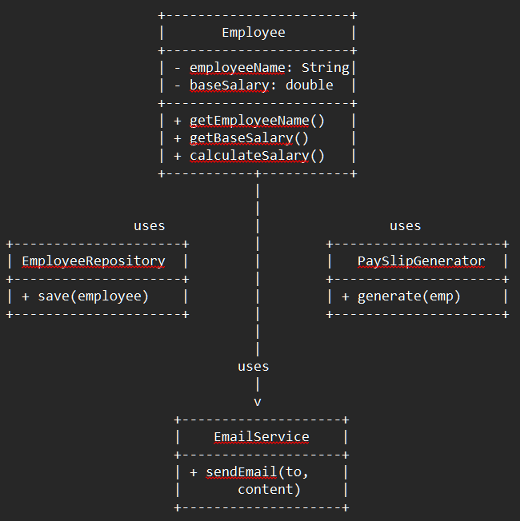

# Single Responsibility Principle (SRP) — Employee Payroll Example

This example demonstrates the **Single Responsibility Principle (SRP)** from the SOLID design principles using a payroll-generation scenario.

SRP states that:

> **A class should have one, and only one, reason to change.**

---

## 🚫 Violation (Problem)

In the violation version, the `Employee` class handles **multiple responsibilities**:

- Salary calculation (business logic)
- Saving to the database (persistence)
- Generating payslip text (report formatting)
- Sending email (communication)

When business rules evolve, this class must change for many unrelated reasons:

- Pay rules adjusted → modify Employee
- Database schema changes → modify Employee
- Payslip format updates → modify Employee
- Email template/server changes → modify Employee

This leads to:

- Low cohesion (class does too many things)
- High coupling (knows too many concerns)
- Fragile code (changes break unrelated behavior)
- Harder unit testing (mocking too much)
- Bloated classes

---

## ✅ SRP-Compliant Solution

Responsibilities are separated into dedicated classes:

| Responsibility | Class | Reason to Change |
|--------------|-------|------------------|
| Represent data & salary rules | `Employee` | Business rule updates |
| Save employee to DB | `EmployeeRepository` | Storage logic changes |
| Generate payslip content | `PaySlipGenerator` | Reporting format changes |
| Send payslip via email | `EmailService` | Email template/server changes |

Now each class has **exactly one** reason to change.

---

## 👌 Benefits of This Design

- High cohesion (each class has a focused purpose)
- Lower coupling (no leaking unrelated concerns)
- Easier unit testing (test components independently)
- Better maintainability
- Cleaner responsibilities
- Reduced side effects
- Clear ownership per concern

---

## 📦 How It Works

`Main.java`:

1. Creates an `Employee`
2. Calculates salary
3. Generates the payslip
4. Saves employee data to the database
5. Sends the payslip via email

Each action is delegated to the proper class.

---

## 🧪 Testability Win

You can now test:

- Salary logic without email concerns
- Email sending without salary logic
- Payslip formatting without persistence
- Repository behavior without formatting logic

Testing becomes **simple, isolated, reliable**.

---

## 🔥 The Architectural Shift

**Before SRP:** One “god class” handles many responsibilities.

**After SRP:** Small classes focused on a single responsibility.

This reduces:

- Change ripple effects
- Merge conflicts
- Regression risks
- Debugging complexity

---

## 🧠 UML (Simplified)

---

## 🛑 Common Interview Traps

- “SRP = 1 method per class” ❌ (No. One **reason to change**.)
- “SRP means splitting everything” ❌ (Over-engineering.)
- “If code fits in one class, it’s fine” ❌ (Changes still break unrelated concerns.)
- “Just add comments” ❌ (Comments ≠ design.)

---

## ✅ When to Use

Use SRP when:

- A class keeps expanding in size
- Changing one thing breaks another
- Unit tests become harder
- Comments start grouping unrelated behavior

---

## 🏁 One-Liner Summary

> SRP ensures each class focuses on one responsibility, giving the code fewer reasons to change and fewer unintended side effects.

---

Happy coding! 🚀
